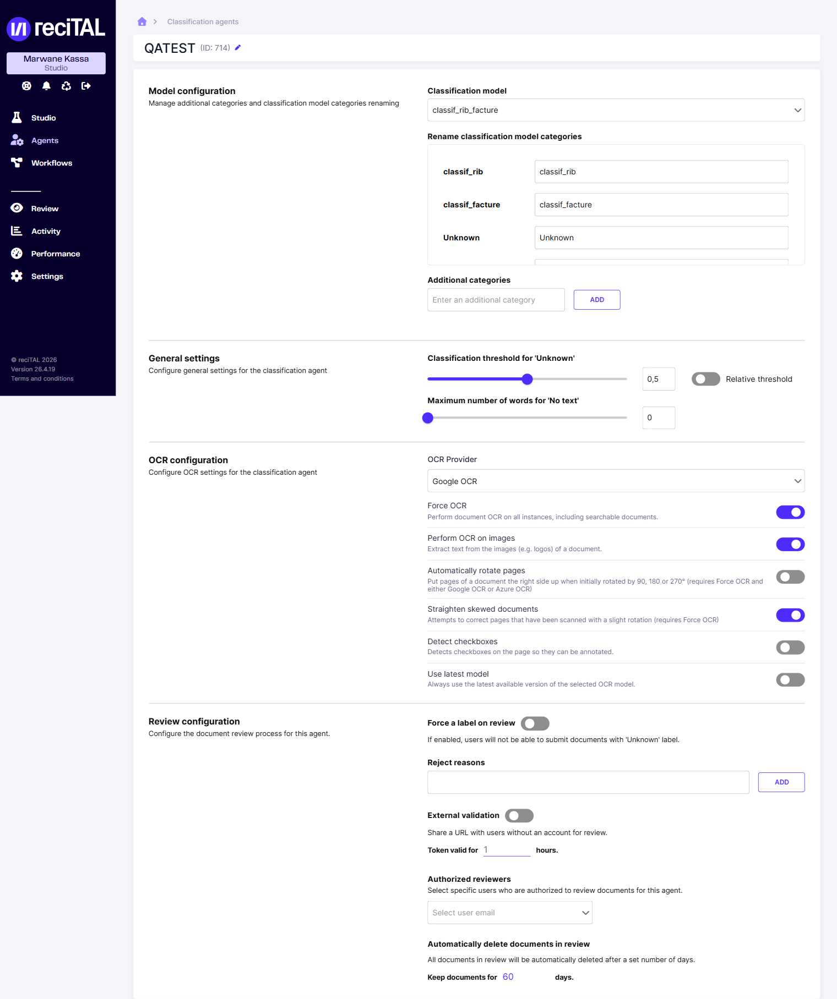

# Configurer un Agent de Classification

Un **Agent de classification** applique un [modèle de classification entraîné dans Studio](entrainer-un-modele-de-classification/entrainement-du-modele.md) pour catégoriser automatiquement les documents. Une fois configuré, il s'utilise dans un [Workflow](../workflow/les-modules-workflow.md) (module *Documents classification agent*) ou par [API](../integration-api/classification/structure-des-resultats-de-classification.md).

## Formats des documents traités par un Agent de classification {#formats-des-documents-traites-par-un-agent-de-classification}

Un Agent de classification accepte les PDF (`.pdf`), les images JPEG (`.jpg`, `.jpeg`, `.jfif`), PNG (`.png`), TIFF (`.tif`, `.tiff`), BMP (`.bmp`) et PNM (`.pnm`), les fichiers texte (`.txt`, `.html`) et les documents bureautiques (`.doc`, `.docx`, `.ppt`, `.pptx`, `.xlsx`). Les PDF et TIFF peuvent comporter plusieurs pages.

Le type est déterminé à partir du contenu du fichier, et non de sa seule extension ou du type MIME déclaré lors de l'envoi. Le module *Documents classification agent* d'un Workflow transmet également le document à cet Agent. Par rapport aux [formats d'un Agent d'extraction](../extraction/configurer-un-agent-dextraction/README.md#formats-des-documents-traites-par-un-agent-dextraction), cette liste ajoute BMP, JFIF et PNM ; elle ne comprend pas les autres formats bureautiques de la liste d'extraction.

## Créer un Agent

Dans la sidebar, ouvrir **Agents** puis l'onglet **Classification**, et cliquer **Create classification agent**. La liste récapitule, pour chaque Agent, son **modèle de classification**, son **OCR** et son **seuil**.

Renseigner un nom, puis sélectionner le modèle de classification à utiliser. La configuration de l'Agent s'organise ensuite en quatre sections.

<figure><figcaption>Les quatre sections de configuration d'un Agent de classification.</figcaption></figure>

## 1. Model configuration

<table><thead><tr><th width="260">Paramètre</th><th>Description</th></tr></thead><tbody><tr><td><strong>Classification model</strong></td><td>Le modèle de classification (entraîné dans Studio) utilisé par l'Agent.</td></tr><tr><td><strong>Rename classification model categories</strong></td><td>Renommer les catégories du modèle pour l'affichage. Deux catégories spéciales sont toujours présentes : <strong>Unknown</strong> (confiance insuffisante) et <strong>No text</strong> (document sans texte exploitable).</td></tr><tr><td><strong>Additional categories</strong></td><td>Ajouter des catégories supplémentaires au-delà de celles du modèle.</td></tr></tbody></table>

## 2. General settings

<table><thead><tr><th width="260">Paramètre</th><th>Description</th></tr></thead><tbody><tr><td><strong>Classification threshold for 'Unknown'</strong></td><td>Seuil de confiance (0 à 1, 0.5 par défaut) en dessous duquel un document est classé <strong>Unknown</strong>. L'option <strong>Relative threshold</strong> applique le seuil par rapport à l'écart entre les deux meilleures catégories plutôt qu'en valeur absolue.</td></tr><tr><td><strong>Maximum number of words for 'No text'</strong></td><td>Nombre de mots maximal en dessous duquel un document est classé <strong>No text</strong> (document considéré comme sans texte).</td></tr></tbody></table>

## 3. OCR configuration

<table><thead><tr><th width="260">Paramètre</th><th>Description</th></tr></thead><tbody><tr><td><strong>OCR Provider</strong></td><td>Le moteur OCR utilisé (par ex. Google OCR).</td></tr><tr><td><strong>Force OCR</strong></td><td>Effectue l'OCR sur tous les documents, y compris ceux déjà cherchables.</td></tr><tr><td><strong>Perform OCR on images</strong></td><td>Extrait le texte présent dans les images d'un document (ex. logos).</td></tr><tr><td><strong>Automatically rotate pages</strong></td><td>Redresse les pages pivotées de 90, 180 ou 270° (nécessite Force OCR et Google ou Azure OCR).</td></tr><tr><td><strong>Straighten skewed documents</strong></td><td>Corrige les pages numérisées avec une légère inclinaison (nécessite Force OCR).</td></tr><tr><td><strong>Detect checkboxes</strong></td><td>Détecte les cases à cocher de la page pour permettre leur annotation.</td></tr><tr><td><strong>Use latest model</strong></td><td>Utilise toujours la dernière version disponible du modèle OCR sélectionné.</td></tr></tbody></table>

## 4. Review configuration

<table><thead><tr><th width="260">Paramètre</th><th>Description</th></tr></thead><tbody><tr><td><strong>Force a label on review</strong></td><td>Si activé, les utilisateurs ne peuvent pas valider un document portant le label <strong>Unknown</strong>.</td></tr><tr><td><strong>Reject reasons</strong></td><td>Liste de motifs de rejet proposés aux relecteurs.</td></tr><tr><td><strong>External validation</strong></td><td>Partage une URL de review avec des utilisateurs sans compte. Le <strong>token</strong> reste valable un nombre d'heures paramétrable.</td></tr><tr><td><strong>Authorized reviewers</strong></td><td>Restreint la review de cet Agent à des utilisateurs (emails) spécifiques.</td></tr><tr><td><strong>Automatically delete documents in review</strong></td><td>Supprime automatiquement les documents en review après un nombre de jours défini (60 par défaut).</td></tr></tbody></table>

## Voir aussi

- [Entraîner un modèle de classification](entrainer-un-modele-de-classification/entrainement-du-modele.md)
- [Les modules de Workflow](../workflow/les-modules-workflow.md) — module *Documents classification agent*
- [Structure des résultats de classification](../integration-api/classification/structure-des-resultats-de-classification.md)
