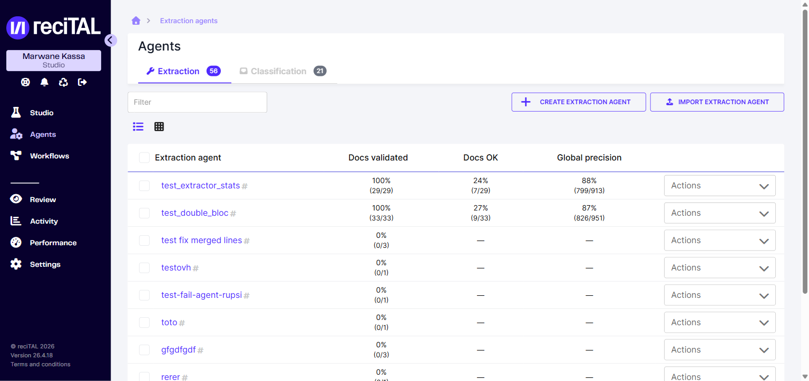
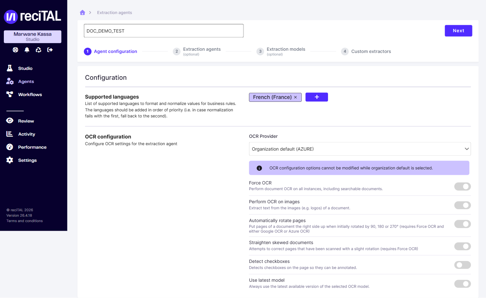
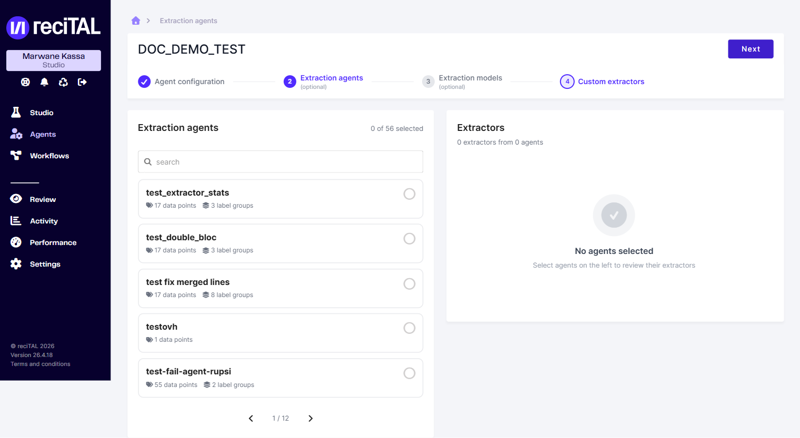
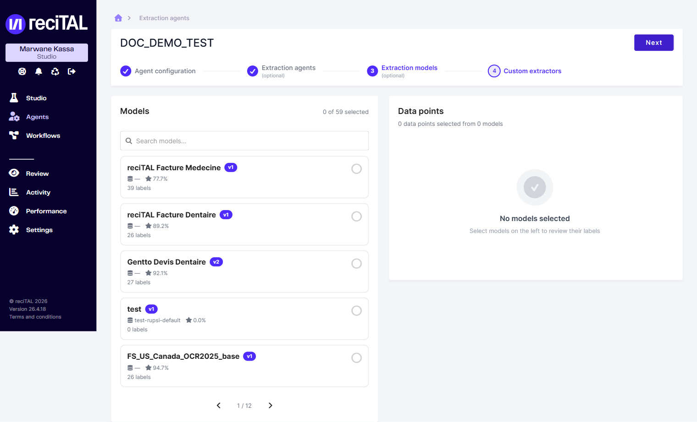
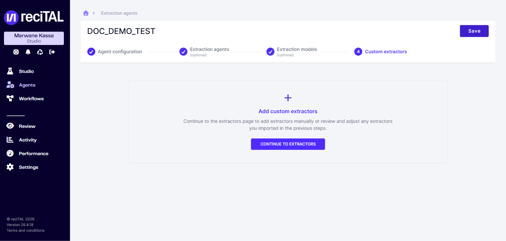
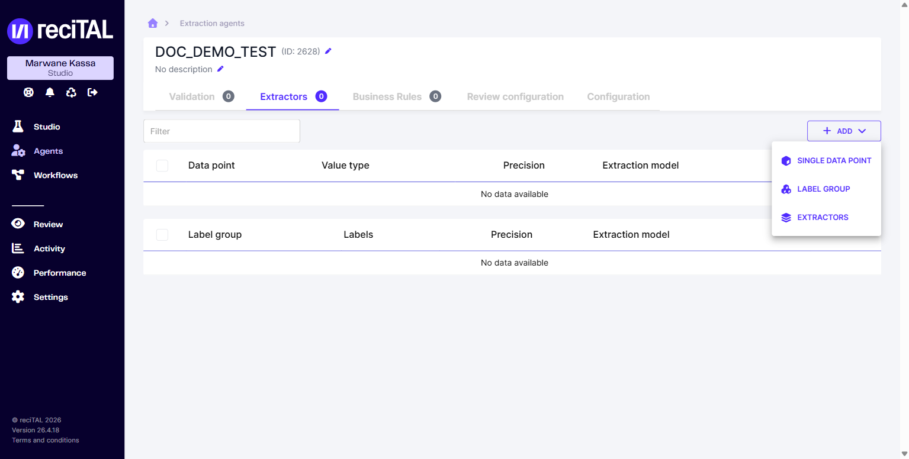
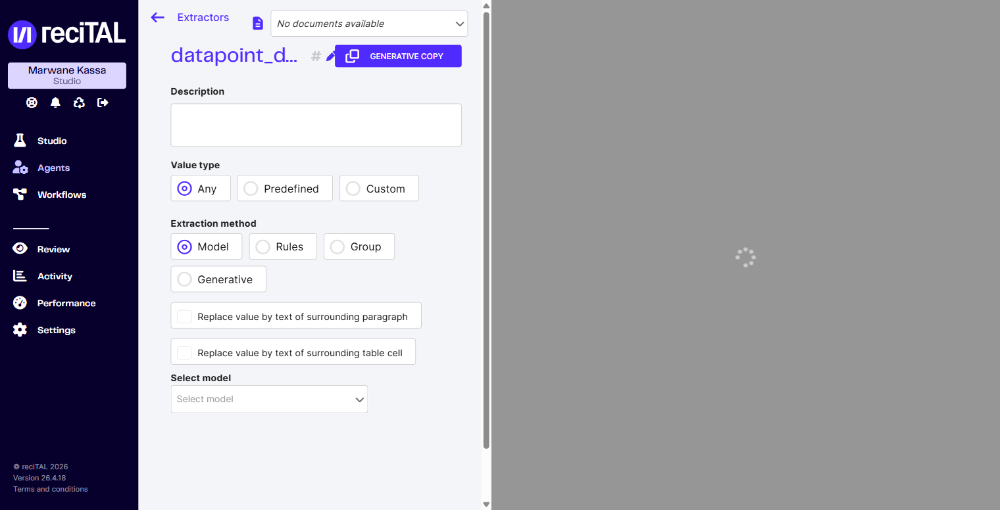
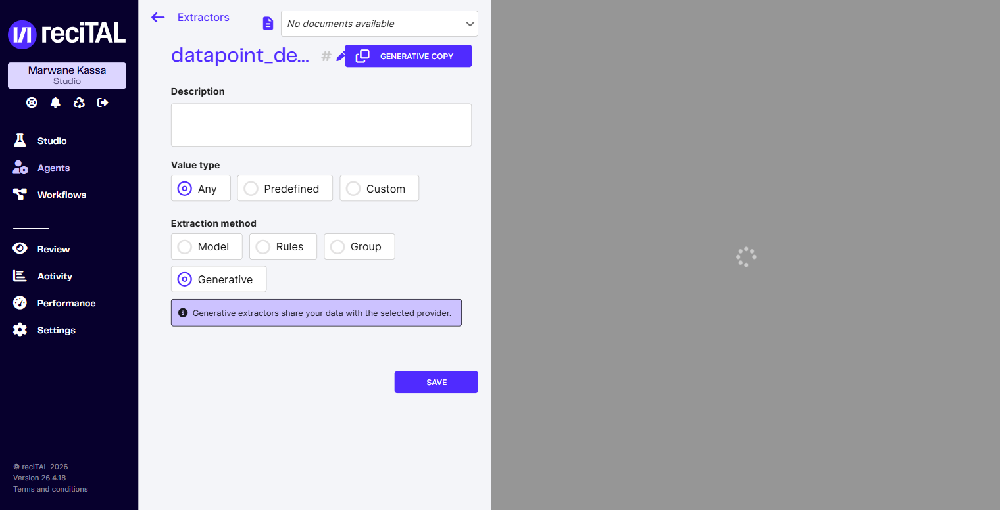

# Créer un agent génératif

Un agent génératif utilise un **LLM** (Large Language Model) pour extraire l'information à partir d'un prompt, sans nécessiter de dataset annoté ni de modèle entraîné. C'est la voie la plus rapide quand on démarre.

## 1. Créer l'agent

Dans la sidebar, cliquer **Agents** puis le bouton **Create extraction agent**.

<figure><figcaption>Liste des agents d'extraction. Bouton de création en haut à droite.</figcaption></figure>

Le wizard de création comporte 4 étapes :

### Étape 1 — Configuration

Renseigner le nom de l'agent puis les langues supportées et la configuration OCR. La configuration par défaut de l'organisation est utilisée si rien n'est précisé.

<figure><figcaption>Étape 1 — langues + OCR.</figcaption></figure>

### Étapes 2 et 3 — Imports (optionnels)

L'étape 2 permet de reprendre des extracteurs depuis un autre agent. L'étape 3 d'attacher un modèle d'extraction entraîné dans Studio. Pour un agent purement génératif, ces deux étapes peuvent être ignorées.

<figure><figcaption>Étape 2 — reprise depuis un autre agent (optionnel).</figcaption></figure>

<figure><figcaption>Étape 3 — sélection d'un modèle entraîné (optionnel).</figcaption></figure>

### Étape 4 — Custom extractors

Confirmer la création de l'agent. La configuration des extracteurs se fait sur la page dédiée juste après.

<figure><figcaption>Étape 4 — Save pour finaliser, puis Continue to extractors.</figcaption></figure>

## 2. Ajouter un datapoint génératif

L'agent est créé, on arrive sur la page des extracteurs (vide). Cliquer **Add** puis **Single data point**.

<figure><figcaption>Menu Add &#x2014; trois types : Single data point, Label Group, Extractors.</figcaption></figure>

Nommer le datapoint, puis dans le formulaire de configuration, sélectionner **Extraction method → Generative**.

<figure><figcaption>Méthodes d'extraction disponibles : Model (par défaut), Rules, Group, et Generative.</figcaption></figure>

<figure><figcaption>Méthode Generative sélectionnée. La plateforme rappelle que les données sont transmises au provider LLM.</figcaption></figure>


Un datapoint génératif transmet le contenu du document au provider LLM configuré dans l'organisation.


Pour le détail de la configuration (prompt, provider, paramètres avancés), voir [Datapoint génératif](../agents/configurer-un-agent-dextraction/configurer-les-extracteurs-dun-agent.md#datapoint-generatif) dans la configuration des extracteurs.

## Pour aller plus loin

- [Configurer les paramètres de l'agent](../agents/configurer-un-agent-dextraction/configurer-les-parametres-dun-agent.md) — règles métier, post-traitement, OCR avancé
- [Valider un Agent](../agents/valider-un-agent/README.md) — charger des documents test et valider la qualité d'extraction
- [Intégration API](../integration-api/authentification.md) — appeler l'agent depuis vos applications
