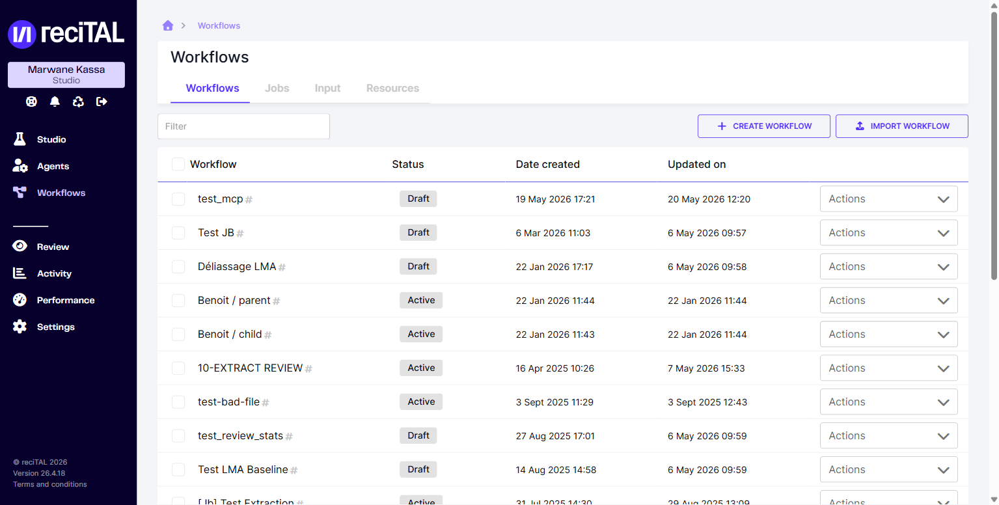
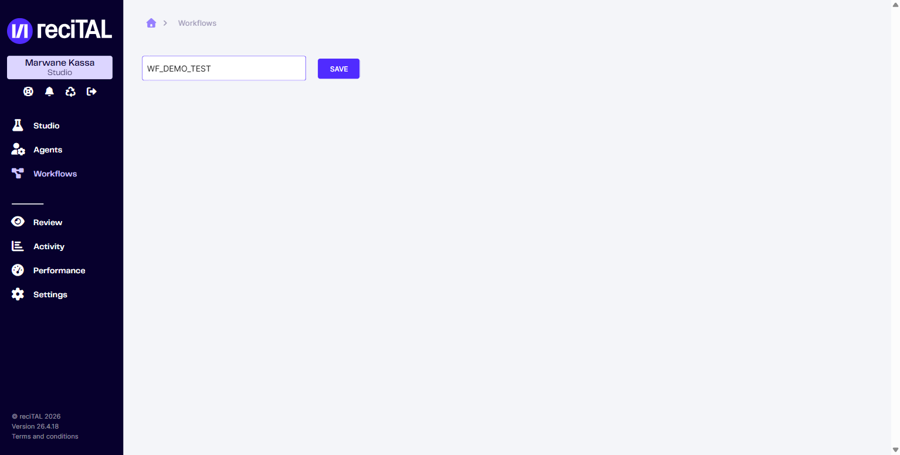
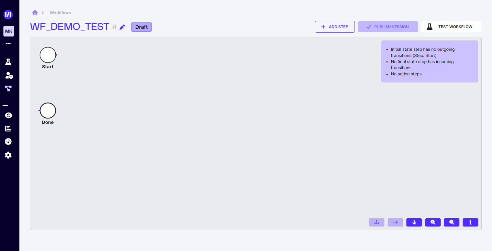
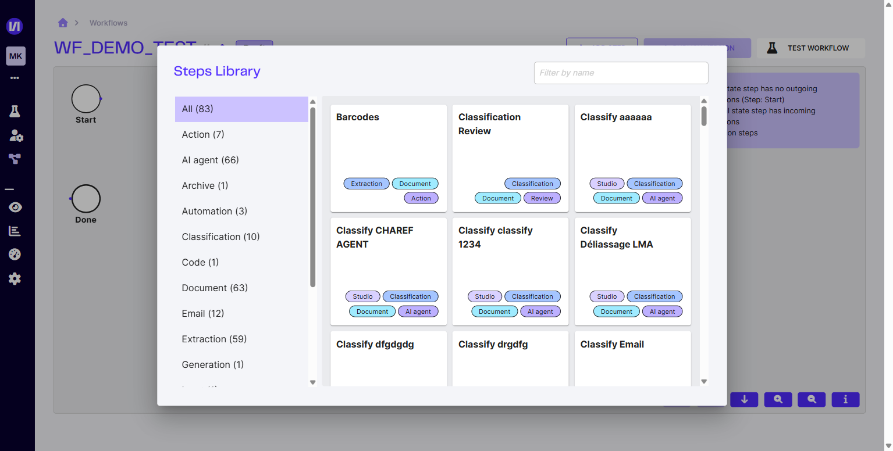

# Créer un workflow

Un workflow orchestre plusieurs étapes (extraction, classification, post-traitement, actions) appliquées aux documents qui le traversent. Il se construit visuellement dans l'éditeur.

## 1. Créer le workflow

Dans la sidebar, cliquer **Workflows** puis le bouton **Create workflow**.

<figure><figcaption>Liste des workflows existants. Bouton de création en haut à droite.</figcaption></figure>

Renseigner le nom puis **Save** pour entrer dans l'éditeur.

<figure><figcaption>Étape unique &#x2014; un nom et Save.</figcaption></figure>

## 2. L'éditeur de workflow

Le canvas s'ouvre en mode **Draft** avec deux étapes par défaut : **Start** (entrée) et **Done** (sortie). Aucune transition n'est définie — la liste de validation à gauche signale les erreurs structurelles à corriger avant publication.

<figure><figcaption>Canvas avec Start et Done par défaut. Le panneau de gauche liste les erreurs de configuration.</figcaption></figure>

## 3. Ajouter des étapes

Cliquer **Add step** ouvre la **Steps Library** : un catalogue de modules filtrables par 16 étiquettes (Action, AI agent, Archive, Automation, Classification, Code, Document, Email, Extraction, Generation, Input, Output, Post-processing, Review, State, Validation).

<figure><figcaption>Steps Library &#x2014; modules filtrables par étiquette ; le champ de recherche filtre par nom. Le nombre de modules par catégorie dépend des agents et modèles de votre organisation.</figcaption></figure>

Cliquer sur un module l'ajoute au canvas. Connecter ensuite les transitions entre Start, vos étapes, et Done.

Pour le détail des modules disponibles, voir :

- [Les modules de workflow](../workflow/les-modules-workflow.md) — tous les types de modules
- [Actions workflows standard](../workflow/actions-workflows-standard.md) — les 7 actions standard (Barcodes, Forward Email, Merge Documents, Send Email, Split Document, Unpack, Workflow)

## 4. Tester et publier

Une fois les transitions définies, le bouton **Test workflow** lance un test à blanc sur un document fourni. Quand la validation passe, **Publish version** rend le workflow actif et utilisable via l'API ou via la connexion d'une boîte mail.

## Pour aller plus loin

- [Connexion boîte mail](../workflow/connexion-boite-mail.md) — déclencher le workflow sur les mails entrants
- [Les jobs](../workflow/jobs.md) — suivre les exécutions
- [Intégration API > Workflow](../integration-api/workflow/README.md) — appeler le workflow depuis vos applications
