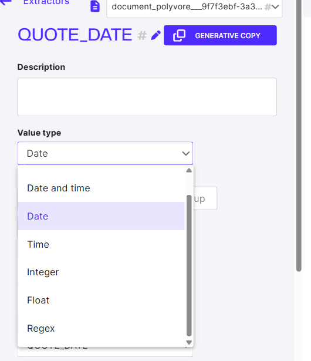

# Configurer les extracteurs d'un Agent


Si l'Agent a été créé à partir d'un modèle existant (custom ou sur étagère), tous les labels du modèle sont créés comme des champs uniques.


## Créer un nouveau champs unique

### Création

Un champ unique, comme son nom l'indique, ne sera extrait qu'une seule fois dans un document. Par exemple, sur une facture : la date d'émission, le montant HT ou le n° de facture.

<figure><figcaption></figcaption></figure>

Ajoutez un Datapoint, donnez un nom à votre nouveau champs, puis enregistrez.

### Configuration

<figure><figcaption></figcaption></figure>

#### Type de valeur (Value type)

Le type de valeur normalise le champ extrait. Il se choisit dans une liste déroulante :

<figure><figcaption>Les types de valeur disponibles pour un datapoint.</figcaption></figure>

| Value type | Détail | Exemples |
|---|---|---|
| **Any** (Tout) | N'importe quelle chaîne de caractères — valeur par défaut. | Nom, Prénom, Désignation |
| **Date and time** | Une date accompagnée d'une heure. | Date et heure de dépôt, horodatage d'un accusé de réception |
| **Date** | Une date, normalisée au format `YYYY-MM-DD`. | Date d'émission, date d'échéance |
| **Time** | Une heure seule. | Heure de rendez-vous, heure de passage |
| **Integer** | Un nombre entier. | Nombre d'unités, quantité |
| **Float** | Un nombre décimal. | Montant HT, pourcentage |
| **Regex** | Expressions régulières. La 1ʳᵉ expression doit correspondre au champ extrait ; dans la 2ᵉ, on peut réutiliser les groupes capturés (`\1`, `\2`, …) pour la normalisation. | N° de téléphone, référence client, code-barres |

#### **Méthode d'extraction**

C'est la façon dont le champ sera extrait dans le document.&#x20;

La méthode par défaut est **Model** : sélectionnez le modèle entraîné et sa version, puis le label du modèle correspondant.


À noter que plusieurs modèles peuvent être utilisés pour des champs différents. Cela permet, par exemple, d'associer 2 labels à un même mot (ce qui est impossible avec un seul modèle). Cependant, lors d'une prédiction, chaque modèle sera appelé, ce qui augmentera le temps de traitement.

Par exemple, configurer un premier extracteur "Adresse", qui capture une adresse entière, et un deuxième extracteur "Code Postal" depuis un autre modèle. Ainsi, dans le document, le code postal aura à la fois le label "Code Postal" et "Adresse".


Il est également possible d'utiliser les expressions régulières (**Rules**) pour extraire un champ : saisissez la regex, puis, en option, délimitez une zone du document où chercher l'expression.


Il est aussi possible de sélectionner **Generative** comme méthode d'extraction.

En mode génératif, le nom et la description du datapoint servent de consigne au LLM pour extraire la valeur. Une description peut aussi être renseignée au niveau de l'Agent d'extraction.


## Créer un nouveau groupe de champs

### Création

Lorsqu’il s’agit de lignes d’un tableau par exemple, il convient de les mettre sous forme de groupe. Si vous avez créé un Agent depuis un modèle, supprimez les champs concernés de la partie "Data point" et créez un groupe d’étiquettes.

<figure><figcaption></figcaption></figure>

Rentrez le nom du groupe et choisissez le modèle d'extraction utilisé pour ce groupe.

### Configuration

#### Méthode d'agrégation

* **Ligne** : Les éléments sur une même ligne sont rassemblés en un groupe. Par exemple avec les factures pour rassembler dans un même groupe la désignation, le prix, la quantité, etc.
* **Ligne divisée** : Identique à ligne, mais permet d'avoir 2 groupes différents si 2 tableaux sont côte à côte sur la même ligne par exemple.
* **Colonne** : Les éléments sur une même colonne sont rassemblés en un groupe.
* **Bloc** : Les éléments successifs dans un document sont rassemblés en un groupe sans contrainte de ligne ou de colonne (seul l'ordre de lecture compte). Un nouveau groupe est créé à chaque nouvelle itération.
* **Cluster** : Permet de rapprocher des champs par proximité dans le document, sans tenir compte d'un alignement vertical ou horizontal. Par exemple pour les adresses (rue, code postal, ville)
* **Ligne de tableau** : Utilisation de la détection de tableau requis. Identique à LIGNE mais se base sur la reconnaissance de tableau.
* **Cellule de tableau** : Utilisation de la détection de tableau requis. Identique à COLONNE mais se base sur la reconnaissance de tableau.

<figure><figcaption></figcaption></figure>

**Conserver les valeurs des X meilleurs pages :** Par défaut dans un groupe, toutes les occurrences du groupe (sous-groupe) seront extraites, mais il est possible de limiter les extractions seulement aux "meilleures" pages. Particulièrement utile si on sait par exemple que l'information n'est que sur 1 page. Si l'option est activée, alors on peut exclure lors du calcul des meilleures pages les pages contenant une valeur spécifique.

**Créer des sous-groupes vides pour les étiquettes primaires sans valeur :** Utilisation avancée des groupes, permettant de créer autant de sous-groupe qu'il existe de champs primaires.

**Afficher les étiquettes primaires sans valeur** : Par défaut les champs d'un sous-groupe non-extrait n'apparaissent pas dans les résultats. Si cette option est activée, ils apparaitront avec la valeur "N/A". Cela permet d'avoir un squelette de JSON fixe lors de l'envoie des résultats.

**Afficher les groupes à valeur unique** : Par défaut un sous-groupe est créé si 2 champs ou plus sont présents. Si cette option est activée, un groupe est créé même avec 1 seul champ, si ce dernier est primaire.

#### Ajouter les champs à extraire dans le groupe

Ajoutez un par un les champs provenant du modèle à ajouter dans le groupe. Pour chaque champ, vous pouvez configurer un type de valeur (voir "[Créer un nouveau champ unique](configurer-les-extracteurs-dun-agent.md#creer-un-nouveau-champs-unique)"), et désigner si ce dernier est primaire ou non. Un champ primaire autorise la création d'un sous-groupe s'il est extrait. Le sous-groupe n'est pas créé si aucun champ primaire n'est extrait.

## Datapoint génératif {#datapoint-generatif}

Au-delà des méthodes basées sur un modèle entraîné, des règles ou un groupe, un datapoint peut être configuré pour extraire la valeur via un **LLM** (Large Language Model). C'est le **datapoint génératif**.

### Activer le mode génératif

Dans la configuration d'un datapoint (créé via **Add → Single data point**), sélectionner **Extraction method → Generative**.

<figure><figcaption>Les 4 méthodes : Model, Rules, Group, Generative.</figcaption></figure>

<figure><figcaption>Méthode Generative active. Un avertissement rappelle que les données sont partagées avec le provider LLM.</figcaption></figure>

### Cas d'usage

- **Champs non structurés** : résumé, analyse de sentiment, classification libre — là où une expression régulière ou un modèle entraîné classique ne suffit pas
- **Démarrage rapide** : pas de Dataset à constituer ni à annoter, le prompt suffit
- **Champs rares** : valeurs présentes dans peu de documents, où un modèle entraîné manquerait de données


Un datapoint génératif transmet le contenu du document au provider LLM configuré dans l'organisation.


### Cross-refs

- [Créer un Agent génératif](../../demarrage-rapide/creer-un-agent-generatif.md) — tutoriel de démarrage
- [Configurer les paramètres d'un Agent](configurer-les-parametres-dun-agent.md) — paramètres avancés et configuration LLM côté organisation
