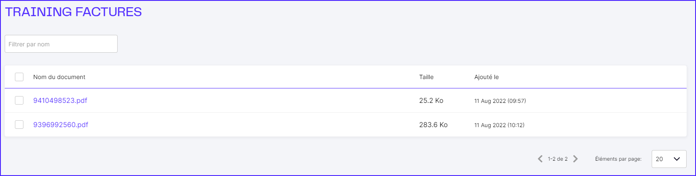
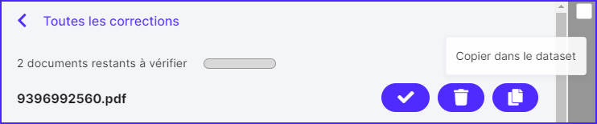
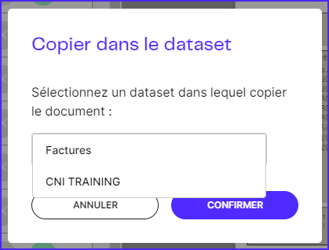

# Ecran de correction

## Corrections

L’écran de correction présente tous les documents extraits par des modèles en production et envoyés en correction.

.png>)

Cliquez sur le nom de l'Agent pour accéder aux documents à corriger.

Cliquez sur le nom d’un document pour rentrer en mode Correction.

<figure><figcaption></figcaption></figure>

Si le document ne convient pas ou est hors scope, il est possible de le rejeter via le bouton **Discard**.

.png>)

Pour valider un champ, cliquer sur le bouton **Mark as reviewed** (la coche passe au vert).

Pour corriger un champ, cliquez sur la valeur puis entourez dans le document la bonne valeur.

Une fois tous les data points validés ou corrigés, cliquer sur **Validate**.

.png>)

Si un document présente trop d’erreurs car le modèle n’a pas été suffisamment entraîné sur ce format, il est possible de l’ajouter au dataset. Pour ce faire, cliquez sur le bouton **Copy to dataset**.

Puis sélectionnez le dataset et cliquer sur confirmer.

