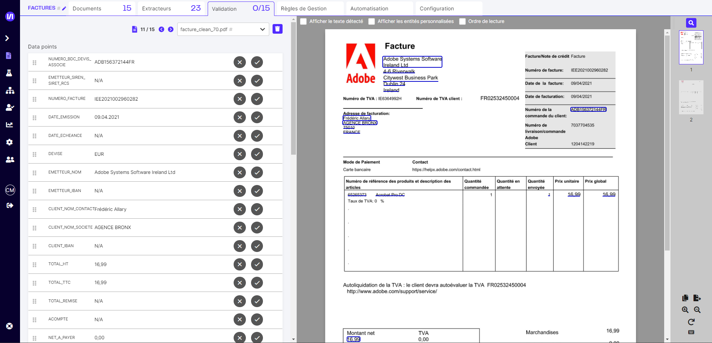
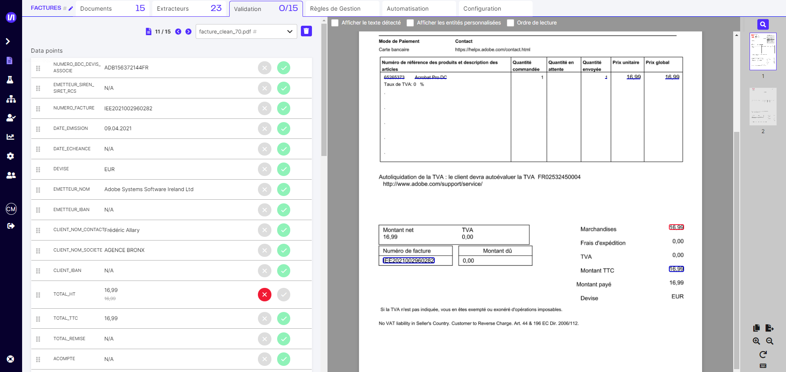

# Valider un Agent

## Valider des documents

Une fois les documents chargés, cliquez sur le premier document. L’écran de validation s’affiche à gauche avec les valeurs extraites.

<figure><figcaption>
<em>Validation - écran de validation</em>
</figcaption></figure>

Vous pouvez valider ou corriger chaque champ.

Pour valider, cliquez sur le bouton de validation, ou bien cliquez directement sur le champ extrait dans le document. Pour corriger, cliquez sur la croix puis sélectionnez à l’aide de la souris dans le document la bonne valeur.

<figure><figcaption>
<em>Validation - correction</em>
</figcaption></figure>

Une fois que tous les data points ont été validés ou corrigés, cliquez sur la flèche ou sur `ctrl + Entrée` pour passer au document suivant.

## Résultats

Une fois tous les documents annotés (ou une partie seulement), on peut retrouver les performances de l'Agent dans la page "Agents d'extraction".

**Docs OK:** correspond au nombre de documents ne contenant aucune erreur.

**Précision globale :** part des champs correctement extraits (champs corrects rapportés au total des champs).


Si les performances de l'Agent sont satisfaisantes, verrouillez votre Agent dans les configurations. Cela évitera de le modifier par erreur.


Si l'Agent ne donne pas satisfaction, plusieurs axes d'amélioration peuvent être travaillés.

### Ajouter plus de données

Le Dataset d'entraînement peut ne pas contenir assez de documents si:

* Certains formats sont sous-représentés par rapport à la réalité de la production. Dans ce cas, ajouter des documents de ces formats mal extraits peut améliorer le modèle.
* Les différents formats de documents sont suffisamment présents, mais certaines données spécifiques sont absentes. Dans ce cas, il faut trouver des documents contenant ces données et les ajouter au Dataset.

### Modifier l'annotation de certains libellés

Soit des libellés ne sont pas annotés de façon consistante sur tous les documents, soit il est possible que la façon de les annoter puisse prêter à confusion pour le modèle.

Dans ce cas, il est nécessaire de revoir l'annotation.
