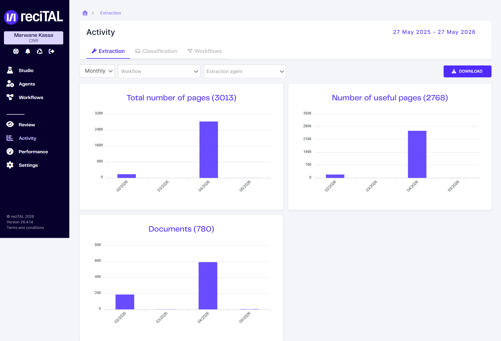

# Activité

L'écran **Activity** montre le volume de documents traités par les agents et workflows sur une période donnée, avec deux indicateurs principaux : **total de pages traitées** et **pages utiles** (pages réellement annotées par les modèles).

## Accès

Dans la sidebar, cliquer sur **Activity**. Trois onglets segmentent les statistiques par type :

- **Extraction**
- **Classification**
- **Workflows**

<figure><figcaption>Vue Activity &#x2014; tab Extraction. Trois histogrammes mensuels : pages totales, pages utiles, et documents traités.</figcaption></figure>

Trois indicateurs sont affichés sur l'onglet **Extraction** :

- **Total number of pages** — toutes les pages soumises aux agents d'extraction
- **Number of useful pages** — pages effectivement annotées par le modèle (les autres sont des pages vides ou ignorées par filtrage)
- **Documents** — nombre de documents complets traités (un document peut contenir plusieurs pages)

## Filtres et période

La barre supérieure permet d'affiner les données affichées :

- **Sélecteur de date** (en haut à droite du titre) : période d'observation. Par défaut, les 12 derniers mois.
- **Granularité** : Monthly / Weekly / Daily.
- **Workflow** : isoler un workflow spécifique.
- **Extraction agent / Classification agent** : isoler un agent spécifique.

## Export

Le bouton **Download** exporte les données brutes correspondant aux filtres actifs (CSV).

## Cas d'usage

- Suivre l'usage de la plateforme par client / équipe pour le **billing** (pages traitées).
- Identifier les pics d'activité (chargement saisonnier, lancement d'un nouveau workflow).
- Comparer **pages totales vs pages utiles** pour estimer le taux d'extraction effective.

Pour une vue plus analytique par agent (taux de précision, statistiques de réviewing), voir [Performance](performance.md).
