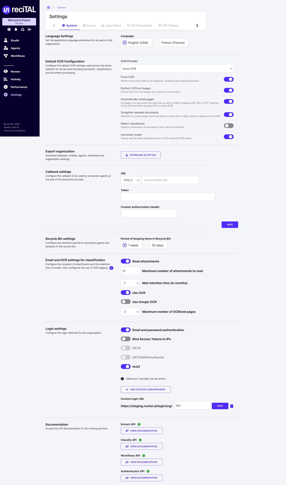

# Paramètres

L'écran **Settings** regroupe la configuration de l'organisation : langue, OCR, utilisateurs, fournisseurs OCR et tokens API.

## Accès

Dans la sidebar, cliquer sur **Settings**. Quatre onglets sont disponibles :

- **System** — langue, configuration OCR par défaut, callback, corbeille, paramètres email/OCR de classification, méthodes de connexion, documentation API
- **Users** — liste et gestion des utilisateurs
- **OCR Providers** — fournisseurs OCR configurés
- **API Tokens** — création et gestion des jetons d'accès API

## System

<figure><figcaption>Settings &#x2014; tab System.</figcaption></figure>

### Language Settings

Définit la langue de l'interface pour tous les utilisateurs de l'organisation. Choix : **English (USA)** ou **French (France)**.

### Default OCR Configuration

Configuration OCR appliquée par défaut à tous les services (extraction, classification, traitement de documents) :

- **OCR Provider** : le fournisseur OCR par défaut (parmi ceux de l'onglet [OCR Providers](#ocr-providers)).
- **Force OCR** : effectue l'OCR sur tous les documents, y compris ceux déjà searchable.
- **Perform OCR on images** : extrait le texte des images (logos, etc.) du document.
- **Automatically rotate pages** : redresse les pages tournées de 90 / 180 / 270° (requiert Force OCR + Google ou Azure OCR).
- **Straighten skewed documents** : corrige les pages scannées avec une légère rotation (requiert Force OCR).
- **Detect checkboxes** : détecte les cases à cocher pour annotation.
- **Use latest model** : utilise systématiquement la dernière version du modèle OCR sélectionné.

### Export organization

Bouton **Download as zip file** : exporte datasets, modèles, agents, workflows et settings de l'organisation dans une archive ZIP. Utile pour les migrations ou sauvegardes.

### Callback settings

Configure le callback utilisé par les agents d'extraction en fin de traitement : **URL**, **Token**, **Custom authorization header**. Bouton **Save**.

### Recycle Bin settings

Définit la durée de rétention des agents d'extraction et datasets dans la corbeille : **1 week** ou **30 days**.

### Email and OCR settings for classification

Configure l'inclusion des pièces jointes et la rétention des emails, ainsi que l'usage de l'OCR (legacy) :

- **Read attachments** : lire les pièces jointes.
- **Maximum number of attachments to read** : nombre maximal de pièces jointes lues.
- **Mail retention time (in months)** : durée de conservation des emails.
- **Use OCR** / **Use Google OCR** : activation de l'OCR (et de Google OCR).
- **Maximum number of OCRized pages** : nombre maximal de pages OCRisées.

### Login settings

Configure les méthodes de connexion de l'organisation :

- **Email and password authentication** : connexion par email / mot de passe.
- **Bind Access Tokens to IPs** : lie les jetons d'accès aux adresses IP.
- Fournisseurs OIDC (ex. **azure-oidc**) et bouton **Add custom login provider**.
- **Custom login URL** : URL de connexion personnalisée de l'organisation.

### Documentation

Liens vers la documentation API des services : **Extract API**, **Classify API**, **Workflows API**, **Authenticator API**.

## Users

Liste les utilisateurs de l'organisation. Colonnes : **Status**, **Email**, **Name**, **Role**. Une barre **Filter** permet de rechercher, et le bouton **Create user** d'ajouter un utilisateur (Prénom, Nom, Email, Role). Le menu **Actions** de chaque ligne permet de modifier ou désactiver un compte.

Voir [Gestion des utilisateurs](../autres/gestion-des-utilisateurs.md) pour le détail des rôles.

## OCR Providers

Liste les fournisseurs OCR de l'organisation. Colonnes : **Name**, **Provider Type**, **Endpoint**, **Max QPS**. Le bouton **Add OCR Provider** ajoute un fournisseur. Les fournisseurs système incluent **Google OCR** (GOOGLE), **Azure OCR** (AZURE) et **DocTR OCR** (DOCTR).

## API Tokens

Gère les jetons d'accès aux APIs reciTAL. Colonnes : **Name**, **Token**. Le bouton **Generate API Token** crée un jeton ; le menu **Actions** permet de le révoquer. Voir [Authentification](../integration-api/authentification.md) pour l'utilisation en pratique.
