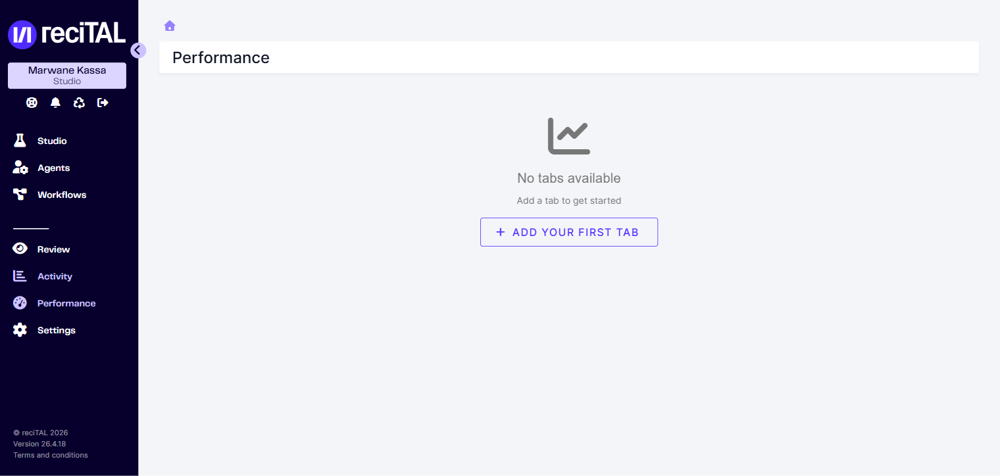
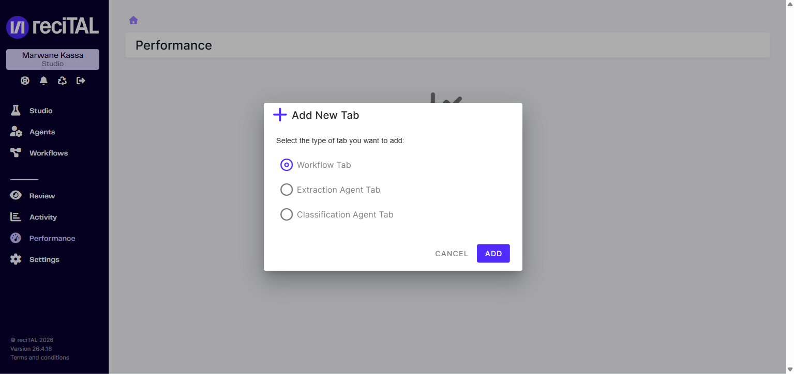

# Performance

L'écran **Performance** permet de construire des tableaux de bord personnalisés autour d'un workflow ou d'un agent particulier, regroupant les indicateurs de qualité (précision, rappel, F1) et le volume associé.

## État initial

À la première ouverture, l'écran est vide : aucun dashboard n'est pré-configuré. Chaque utilisateur compose ses propres onglets.

<figure><figcaption>État initial &#x2014; aucun dashboard n'a encore été ajouté.</figcaption></figure>

## Ajouter un dashboard

Cliquer sur **Add your first tab** (ou le bouton **+** une fois la première tab créée). Un dialog propose trois types :

<figure><figcaption>Choix du type de dashboard à ajouter.</figcaption></figure>

| Type | Suit |
|---|---|
| **Workflow Tab** | Un workflow complet (toutes les étapes) |
| **Extraction Agent Tab** | Un agent d'extraction spécifique |
| **Classification Agent Tab** | Un agent de classification spécifique |

Sélectionner le type, cliquer **Add**, puis configurer l'agent ou le workflow ciblé.

## Indicateurs disponibles

Les indicateurs varient selon le type de tab. Pour les détails métriques (précision, rappel, F1, matrice de confusion), voir [Métriques d'évaluation](../autres/metriques-devaluation.md).

## Vs Activity

[Activity](activite.md) montre le **volume** sur toute l'organisation. **Performance** offre une vue qualitative et ciblée par dashboard.
