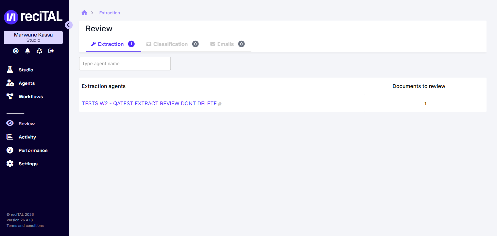

# Review

L'écran **Review** liste tous les documents et emails qui nécessitent une correction humaine avant validation finale, regroupés par agent.

## Accès

Dans la sidebar, cliquer sur **Review**. L'écran est segmenté en trois onglets correspondant aux trois types de tâches :

- **Extraction** — documents passés par un agent d'extraction avec des champs à valider
- **Classification** — documents dont la classe prédite est en revue
- **Emails** — emails à classifier

<figure><figcaption>Vue Review &#x2014; tab Extraction. Chaque ligne représente un agent et le nombre de documents en attente.</figcaption></figure>

Le badge sur chaque onglet indique le nombre total de documents en attente pour le type concerné. Le champ de recherche en haut filtre les agents par nom.

## Reviewer un document

1. Cliquer sur la ligne d'un agent pour ouvrir la liste de ses documents en attente.
2. Cliquer sur un document pour ouvrir l'écran de correction.
3. Corriger les champs extraits (voir [Écran de correction](../agents/ecran-de-correction.md) pour le détail des actions disponibles).
4. Valider — le document quitte la liste de Review et passe en état traité.

> 📸 **Capture requise** : workflow de validation en masse (sélection multiple via checkbox). À ajouter par l'utilisateur depuis la Suite.

## Permissions

Seuls les utilisateurs ayant le rôle approprié peuvent accéder à Review. La gestion des rôles se fait depuis [Paramètres > User Roles](parametres.md#user-roles).
