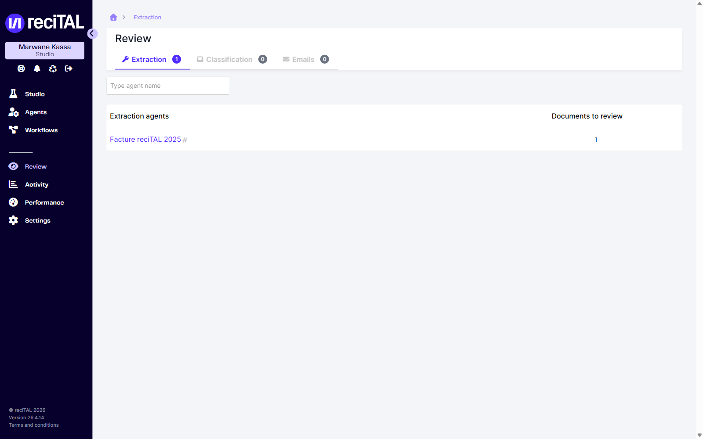
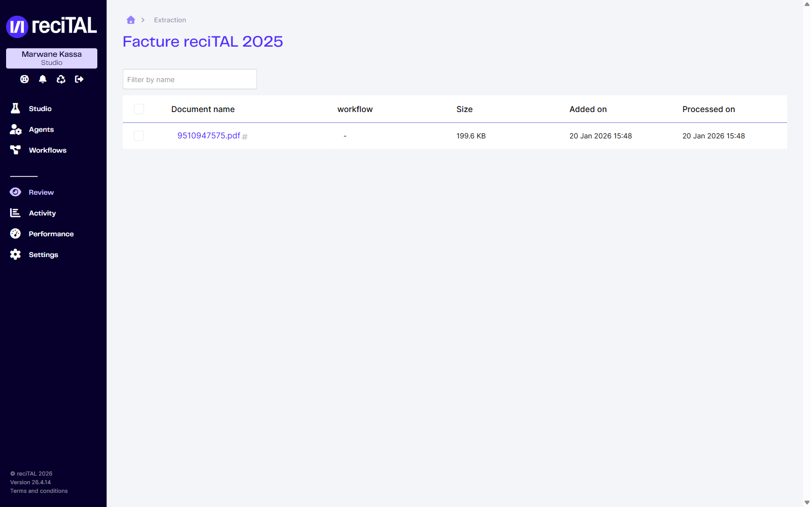
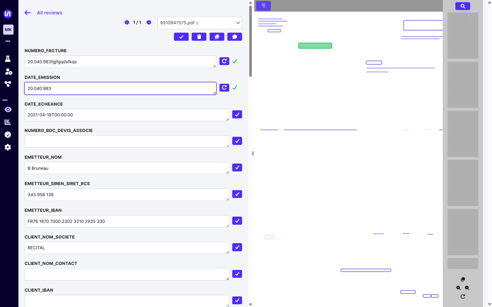
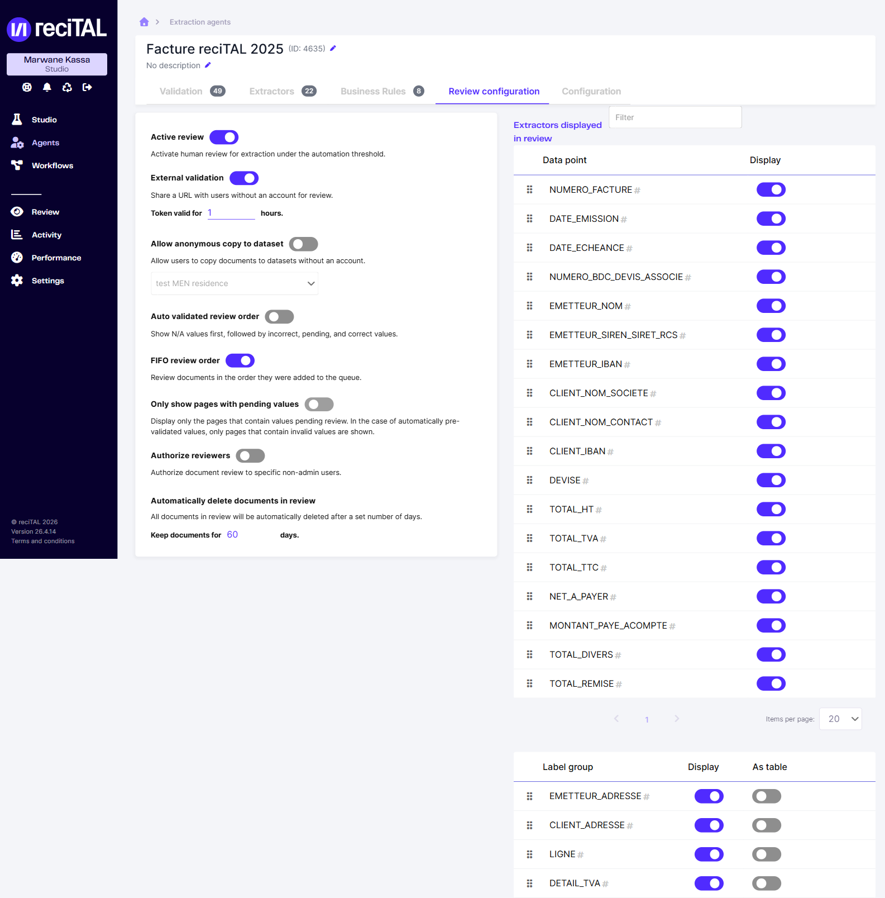

# Review

L'écran **Review** est l'espace de **correction humaine** de la Suite reciTAL. Il regroupe tous les documents et emails dont l'extraction ou la classification automatique nécessite une vérification avant validation finale, organisés par agent.

Un document arrive en Review lorsque la **review est activée** sur l'agent : d'après l'option *Active review*, la correction humaine s'applique aux extractions situées sous le seuil d'automatisation. Tant qu'ils ne sont pas corrigés et validés, ces documents restent dans la file de l'agent.

Ce guide décrit l'écran de correction tel qu'utilisé par les correcteurs, puis la configuration de la review au niveau d'un agent (réservée aux administrateurs).

## Accès et organisation

Dans la barre de navigation, cliquer sur **Review**. L'écran est segmenté en trois onglets correspondant aux trois types de tâches :

- **Extraction** — documents passés par un agent d'extraction avec des champs à vérifier
- **Classification** — documents dont la classe prédite est en revue
- **Emails** — emails à classifier

Le badge de chaque onglet indique le nombre total d'éléments en attente. Le champ de recherche filtre les agents par nom.

<figure><figcaption>Onglet <em>Extraction</em> de Review. Chaque ligne correspond à un agent et au nombre de documents en attente.</figcaption></figure>

Cliquer sur le nom d'un agent ouvre la liste de ses documents à corriger : **nom du document**, **workflow** d'origine, **taille**, **date d'ajout** et **date de traitement**. Les cases à cocher permettent une sélection multiple pour les actions groupées, et le champ **Filter by name** filtre la liste.

<figure><figcaption>Documents en attente de correction pour l'agent sélectionné.</figcaption></figure>

## L'écran de correction

Cliquer sur le nom d'un document ouvre l'écran de correction. Il est divisé en deux zones : à **gauche**, les champs extraits à vérifier ; à **droite**, le document affiché page par page avec les zones détectées.

<figure><figcaption>Écran de correction d'un document. Les boutons d'action sont regroupés en haut de la colonne de gauche.</figcaption></figure>

### Naviguer entre les documents

En haut de l'écran :

- **All reviews** ramène à la file de l'agent.
- Les flèches **‹ / ›** et le compteur (ex. *1 / 1*) ainsi que le menu déroulant du nom de fichier permettent de passer d'un document à l'autre **sans quitter l'écran de correction**.

### La barre d'actions

Quatre boutons sont disponibles en haut de la colonne des champs :

| Bouton | Action |
| --- | --- |
| **Validate** | Valide le document et l'envoie. Il quitte la file ; le document suivant s'affiche. |
| **Discard** | Écarte le document (hors périmètre, illisible, non conforme…). |
| **Copy to dataset** | Copie l'intégralité du document dans un dataset Studio. |
| **Add comment** | Ajoute un commentaire au document. |

### Vérifier et corriger les champs

Chaque champ extrait s'affiche dans une zone de saisie éditable, sous le nom de son extracteur (`NUMERO_FACTURE`, `EMETTEUR_NOM`, `TOTAL_TTC`…).

Pour chaque champ :

- **Mark as reviewed** — le bouton (coche) marque la valeur du champ comme vérifiée.
- **Corriger une valeur** — modifier directement le texte dans la zone de saisie.
- **Revert to extracted value** — lorsqu'une valeur a été modifiée, ce bouton (flèche circulaire) restaure la valeur initialement extraite par le modèle.

#### Groupes et sous-groupes

Les données répétables sont regroupées (ex. `LIGNE` pour les lignes de facture, `EMETTEUR_ADRESSE`, `DETAIL_TVA`). Chaque sous-groupe peut être déplié, complété, ajouté via **Add subgroup** ou supprimé, afin de refléter le nombre réel d'occurrences présentes dans le document.

### Le visualiseur de document

La colonne de droite affiche le document et ses zones détectées. Les outils disponibles :

- **Show detected text** (icône ¶, en haut à gauche) — affiche ou masque le texte détecté par l'OCR en surimpression.
- **Recherche** (loupe, en haut à droite) — recherche dans le texte du document.
- **Miniatures des pages** (colonne de droite) — aperçu des pages du document.
- **Zoom +/‑** et **rotation** (en bas à droite) — ajustent l'affichage et l'orientation pour faciliter la lecture.
- **Add page to dataset** (icône de copie, en bas à droite) — ajoute la **page courante** à un dataset (voir ci-dessous).

## Copier dans un dataset

Deux actions distinctes permettent d'enrichir un dataset Studio à partir d'un document en correction :

- **Copy to dataset** (barre d'actions) — copie le **document entier**.
- **Add page to dataset** (visualiseur) — copie la **page affichée**.

Lorsqu'un document présente trop d'écarts, l'ajouter à un dataset permet d'enrichir l'entraînement et d'améliorer les extractions futures sur ce format.

L'ajout d'une page ouvre une fenêtre où l'on sélectionne le dataset cible. L'option **Generate labels and prefill annotations from the extraction models associated with the extraction agent** pré-remplit les annotations de la page à partir des modèles d'extraction de l'agent, ce qui accélère l'annotation côté Studio.


Voir [Constituer un Dataset](../extraction/entrainer-un-modele-dextraction/constituer-un-dataset.md) et [Annoter un Dataset](../extraction/entrainer-un-modele-dextraction/annoter-un-dataset.md) pour la suite du processus côté Studio.


## Autoriser et configurer la review depuis un agent

La review se paramètre **par agent**, depuis l'onglet **Review configuration** de l'agent d'extraction (**Agents → [agent] → Review configuration**). C'est ici que l'on autorise la review et que l'on règle son comportement.

<figure><figcaption>Onglet <em>Review configuration</em> : activation, validation externe, ordre de traitement et extracteurs affichés.</figcaption></figure>

### Options de la review

| Option | Effet |
| --- | --- |
| **Active review** | Active la correction humaine pour les extractions sous le seuil d'automatisation. **Interrupteur principal** : sans lui, aucun document de l'agent n'est envoyé en Review. |
| **External validation** | Génère une URL partageable permettant à des utilisateurs **sans compte** de corriger un document. Le jeton est valable un nombre d'heures configurable (**Token valid for … hours**). |
| **Allow anonymous copy to dataset** | Autorise ces utilisateurs externes à copier des documents vers un dataset (à sélectionner), sans compte. |
| **Auto validated review order** | Affiche d'abord les valeurs N/A, puis les valeurs incorrectes, en attente et correctes. |
| **FIFO review order** | Traite les documents dans leur ordre d'arrivée dans la file. |
| **Only show pages with pending values** | N'affiche que les pages contenant des valeurs à vérifier (en pré-validation automatique, seules les pages avec valeurs invalides sont montrées). |
| **Authorize reviewers** | Réserve la correction des documents de l'agent à des utilisateurs non-administrateurs spécifiques. |
| **Automatically delete documents in review** | Supprime automatiquement les documents en review au bout d'un nombre de jours défini (**Keep documents for … days**). |

### Extracteurs affichés en review

Le tableau **Extractors displayed in review** liste tous les data points de l'agent ; la colonne **Display** détermine, pour chacun, s'il apparaît sur l'écran de correction. On limite ainsi la correction aux seuls champs pertinents.

Le tableau **Label group** gère de la même façon les groupes (`LIGNE`, `EMETTEUR_ADRESSE`…) : **Display** pour l'afficher, **As table** pour le présenter sous forme de tableau plutôt qu'en sous-groupes empilés.


Les autres paramètres de l'agent (verrouillage, OCR, traitement, normalisation) se trouvent dans l'onglet **Configuration** — voir [Configurer les paramètres d'un Agent](../extraction/configurer-un-agent-dextraction/configurer-les-parametres-dun-agent.md).


## Permissions

L'accès à Review dépend du rôle de l'utilisateur. Dans **Paramètres → Users**, chaque utilisateur porte un rôle, notamment **Reviewer** (correcteur, non-administrateur) ou **Orgadmin** (administrateur de l'organisation). L'option **Authorize reviewers** d'un agent permet de réserver sa file à des utilisateurs non-administrateurs désignés. La gestion des comptes et des rôles se fait depuis [Paramètres](parametres.md) et [Gestion des utilisateurs](../autres/gestion-des-utilisateurs.md).
