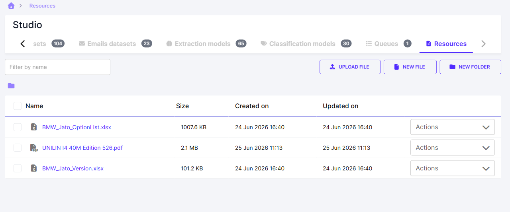

# Ressources

L'onglet **Resources** est un espace de stockage de fichiers et de dossiers propre à l'organisation, utilisable par les workflows. Il est accessible depuis **Studio → Resources** comme depuis **Workflows → Resources** : c'est le même espace dans les deux cas.

<figure><figcaption>L'onglet <strong>Resources</strong> et son arborescence de fichiers.</figcaption></figure>

## Ajouter une ressource

Trois boutons en haut à droite de l'écran :

| Bouton | Effet |
|---|---|
| **Upload File** | Envoyer un fichier depuis votre machine vers le dossier courant. |
| **New File** | Créer un fichier directement dans la plateforme. Une ligne de saisie apparaît dans la liste : donnez un nom, puis validez avec ✓ (ou annulez avec ✗). |
| **New folder** | Créer un sous-dossier pour organiser les ressources. |

## Parcourir et retrouver ses ressources

La liste affiche, pour chaque entrée, les colonnes **Name**, **Size**, **Created on** et **Updated on**. Le fil d'Ariane en haut de page indique le dossier courant ; cliquer sur un dossier permet d'y descendre.

Le champ **Filter by name** filtre la liste sur le nom.

## Agir sur une ressource

Le menu **Actions** à droite de chaque ligne propose :

* **Open** — ouvrir la ressource.
* **Download** — la télécharger.
* **Rename** — la renommer.
* **Delete** — la supprimer.

Les cases à cocher à gauche permettent de sélectionner plusieurs entrées à la fois.


Ces fichiers servent de ressources partagées (fichiers de référence, référentiels, gabarits) que les étapes d'un workflow peuvent réutiliser.

