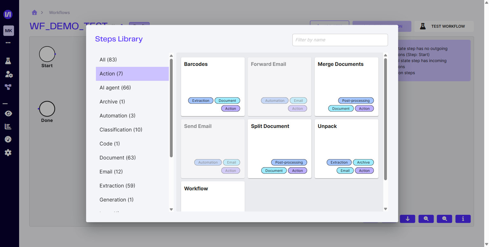

# Actions workflows standard

La **Steps Library** de l'éditeur de workflow expose une catégorie **Action** regroupant 7 modules « techniques » réutilisables dans tout workflow, indépendamment d'un agent ou d'un modèle. **5 sont actuellement disponibles** ; 2 (Send Email et Forward Email) sont marquées **« Available soon »**.

<figure><figcaption>La catégorie <strong>Action</strong> de la Steps Library.</figcaption></figure>

## Les actions standard

| Action | Usage |
|---|---|
| **Barcodes** | Détecter et extraire les codes-barres présents sur les pages du document. |
| **Merge Documents** | Fusionner plusieurs documents en un seul. |
| **Split Document** | Découper un document multi-pages selon des règles (par exemple un changement de classification entre pages). |
| **Unpack** | Décompresser une archive ou éclater une pièce jointe contenant plusieurs documents. |
| **Workflow** | Appeler un autre workflow en sous-étape (composition). |
| **Send Email** _(Available soon)_ | Envoyer un mail (notification, accusé de réception). Bientôt disponible. |
| **Forward Email** _(Available soon)_ | Transférer un mail (et ses pièces jointes) vers une adresse cible. Bientôt disponible. |

## Quand les utiliser

Les actions standard sont à insérer **entre** les étapes métier (extraction, classification, review) pour câbler le flux end-to-end :

- **Avant l'extraction** — Unpack pour traiter une archive, Split Document pour séparer une liasse, Barcodes pour pré-router.
- **Après l'extraction** — Merge Documents pour consolider, Workflow pour enchaîner un sous-traitement. _(Send Email / Forward Email : bientôt disponibles.)_

## Cross-refs

- [Créer un workflow](../demarrage-rapide/creer-un-workflow.md) — créer le workflow et ouvrir l'éditeur
- [Les modules de workflow](les-modules-workflow.md) — toutes les catégories disponibles (AI agent, Classification, Extraction, Review, etc.)
- [Connexion boîte mail](connexion-boite-mail.md) — déclencher un workflow depuis un mail entrant
