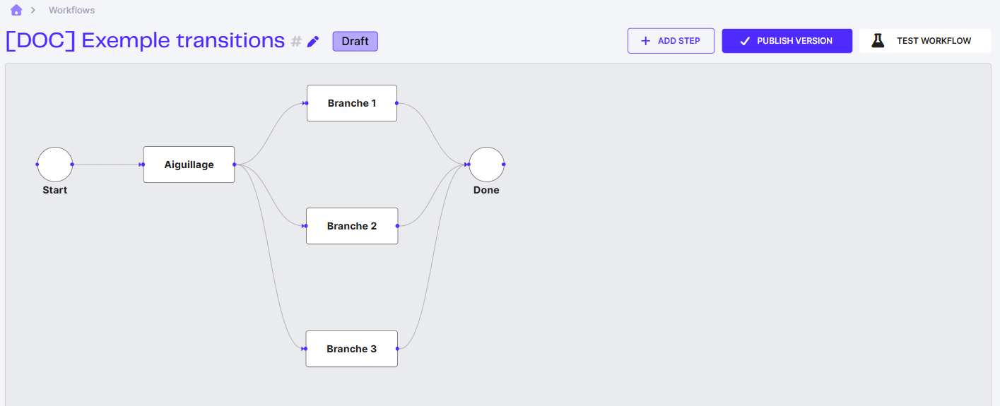
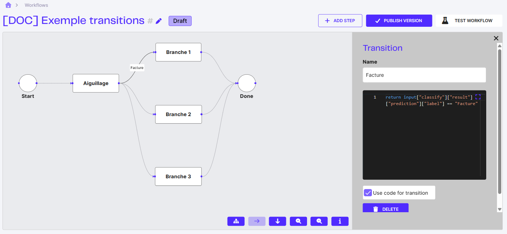

# Créer un Workflow

## Créer un nouveau workflow

Cliquez sur **Create workflow** puis donnez-lui un nom.

<figure><figcaption></figcaption></figure>

<figure><figcaption></figcaption></figure>


Un workflow doit obligatoirement être composé au minimum d'un état **Start** et d'un état **Done**.


## Ajouter des actions

Pour ajouter des actions entre le début et la fin d'un workflow, cliquez sur le bouton **Add step**.

<figure><figcaption></figcaption></figure>

<figure><figcaption></figcaption></figure>

Nous avons une page dédiée à la liste de tous les modules disponibles : [Les modules Workflow](les-modules-workflow.md).

## Ajouter des transitions

Une transition entre 2 modules peut être créée en reliant leurs points d'attache.

<figure><figcaption></figcaption></figure>

Un module peut avoir plusieurs transitions sortantes : le workflow se divise alors en autant de branches, qui peuvent se rejoindre plus loin sur le module **Done**.

<figure><figcaption>Le module <strong>Aiguillage</strong> a trois transitions sortantes, vers trois branches distinctes.</figcaption></figure>

Une transition peut être libre (par défaut) ou bien conditionnelle. Pour créer une transition conditionnelle, cliquez sur la transition, cochez la case "Use code for transition", et écrivez en code Python la condition à respecter pour passer par cette transition.

<figure><figcaption>Transition conditionnelle : un nom, la case <strong>Use code for transition</strong> cochée, et la condition Python. Le nom de la transition s'affiche sur le lien dans le canvas.</figcaption></figure>

## Terminer un workflow

Chaque branche d'un workflow doit se terminer par le module **Done**.

Une fois que l'architecture d'un Workflow est valide, on peut le tester et le publier.

### Publier un workflow

Publier un workflow permet de le tester, et de l'utiliser en production. Pour ce faire, cliquez sur le bouton **Publish version**.

<figure><figcaption></figcaption></figure>

Une fois qu'un workflow est publié, on peut toujours retourner en mode Draft. Tant que le nouveau Draft ne sera pas publié, il n'aura aucun impact sur la production.

### Tester un workflow

Une fois que votre Workflow est publié, vous pouvez le tester.

<figure><figcaption></figcaption></figure>

<figure><figcaption></figcaption></figure>

**Donnée Initiale :**\
Chaque étape du workflow génère des données qui peuvent être utilisées au sein même de ce workflow et que l'on retrouve dans les résultats finaux. Il est également possible de transmettre des données initiales avant même la première étape. Un champ au format JSON est attendu.


Transmettre des données initiales peut être très pratique pour les transitions conditionnelles, notamment si vous savez à l'avance dans quelle branche le workflow doit se diriger (par exemple, effectuer un vidéo-codage ou non).


**Métadonnées personnalisées :**\
Des données sous forme de chaînes de caractères, non exploitables dans le workflow, mais renvoyées telles quelles dans les résultats.


Ce paramètre est souvent utilisé pour transmettre des identifiants internes (ID), afin de les retrouver dans les résultats et d'associer ces derniers à l'ID correspondant.


**Fichiers :**\
Les documents qui seront envoyés dans le workflow. Trois collections par défaut sont disponibles :

* **File :** Utilisée par la plupart des modules par défaut.
* **Email :** Utilisée par le module "Ingest Email" par défaut.
* **Attachment :** Non utilisée par défaut par aucun module, mais pratique dans certains cas spécifiques, comme tester une partie du workflow.
