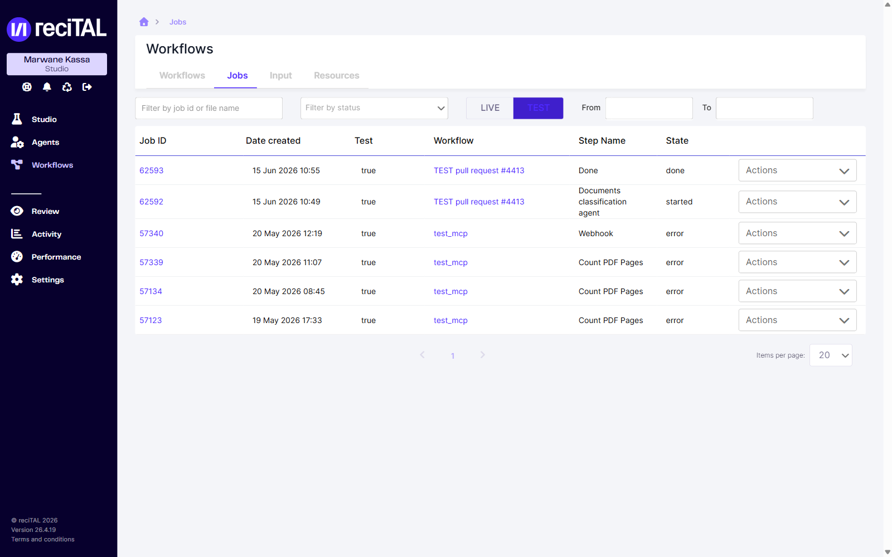
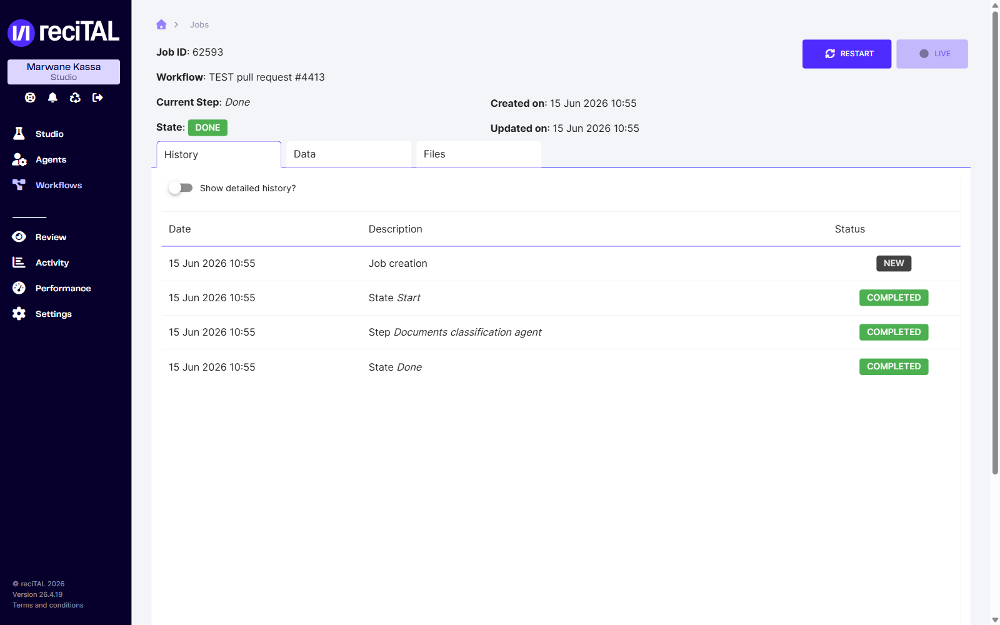
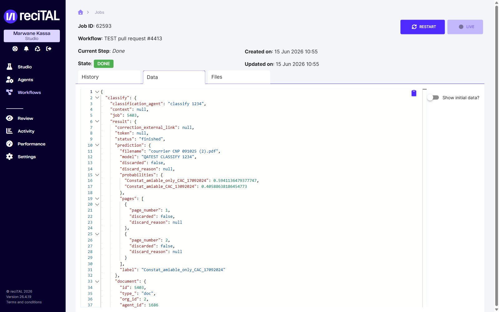
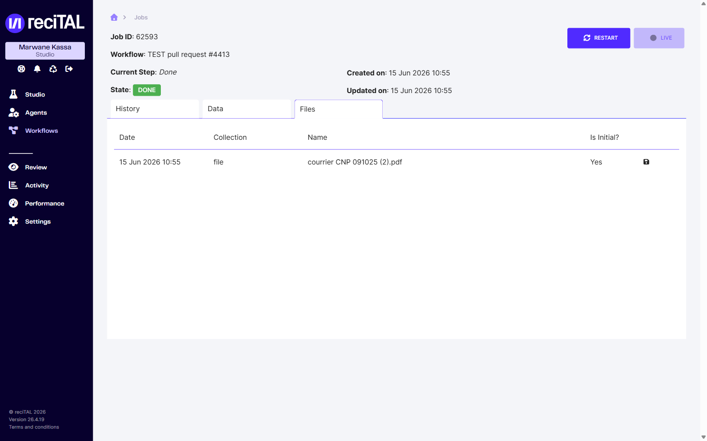

# Jobs

## Qu'est-ce qu'un Job ?

Un Job représente le parcours d'un document au travers du workflow vers lequel il a été envoyé. Chaque Module, Etat ou Transition d'un workflow est retranscrit dans les jobs.


Un job permet de:

* Suivre la progression d'un document.
* Identifier l'état d'un document : started, waiting, done, error, custom.
* Consulter les données à chaque étape du Workflow.
* Voir les logs à chaque étape du Workflow, et donc déboguer si besoin.
* Télécharger les documents originaux et les documents générés.


## Consulter les jobs

Depuis la page **Workflows**, ouvrez l'onglet **Jobs**. Si vous avez réussi à envoyer un premier document — que ce soit par API (voir [Envoyer des documents dans un workflow](../integration-api/workflow/envoyer-des-documents-dans-un-workflow.md)) ou via l'upload d'un document pour tester le workflow — vous devriez voir apparaître un premier job.

Le tableau liste pour chaque job son **ID**, sa **date de création**, s'il s'agit d'un **test**, le **workflow** d'origine, l'**étape** en cours et son **état**. La bascule **Live / Test** sépare les jobs de production des jobs de test, et les filtres (statut, plage de dates, ID ou nom de fichier) permettent de retrouver un job précis.

<figure><figcaption>Onglet <em>Jobs</em> — tableau des jobs avec la bascule Live/Test et les filtres.</figcaption></figure>

Pour consulter les détails d'un job, cliquez sur son **ID**. L'en-tête rappelle l'ID, le workflow, l'étape courante, l'état et les dates ; le bouton **Restart** permet de relancer le job.

### Historique

L'onglet **History** présente le déroulé étape par étape (création du job, états, étapes) avec leur statut. La bascule **Show detailed history?** affiche le détail, et l'on y retrouve les logs — utiles pour déboguer les paramètres d'un module ou un module custom (code Python).

<figure><figcaption>Jobs — onglet <em>History</em>.</figcaption></figure>

### Données

L'onglet **Data** affiche les données accumulées par le job (ajout successif des données à chaque étape), au format JSON. La bascule **Show initial data?** permet de comparer avec les données initiales.

<figure><figcaption>Jobs — onglet <em>Data</em>.</figcaption></figure>

### Fichiers

L'onglet **Files** recense tous les documents dans les différentes collections (avec la date, la collection, le nom et l'indication *Is Initial?*) et permet de les télécharger.


Le module de cleanup supprime les data et tous les fichiers.


<figure><figcaption>Jobs — onglet <em>Files</em>.</figcaption></figure>
