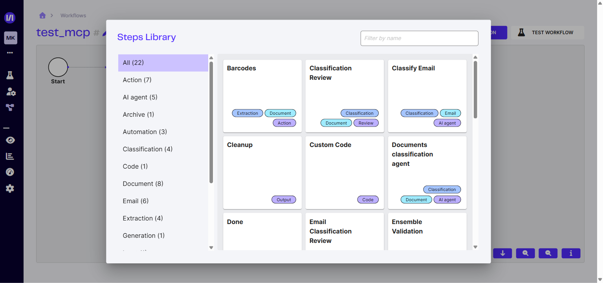

# Les modules Workflow



Dans l'éditeur de Workflow, le bouton **Ajouter une étape** ouvre la bibliothèque **Étapes**. Elle permet de rechercher les modules par nom ou de les filtrer selon **17 catégories** : **Action, AI, Archive, Automation, Classification, Code, Document, Email, Extraction, Génération, Input, Output, Post-processing, Review, Sources, État** et **Validation**. Le filtre général **Tout** s'ajoute à ces 17 catégories.

Les cartes générées à partir des Agents d'extraction, des Agents de classification et des anciens modèles de classification d'e-mail sont des instances configurées propres à votre organisation. Elles ne constituent pas des types d'action Workflow supplémentaires.



<figure><figcaption>La bibliothèque <em>Étapes</em> (bouton <strong>Ajouter une étape</strong>) — catalogue de modules filtrable par catégorie.</figcaption></figure>

Les catégories décrivent plusieurs dimensions d'un même module. Par exemple, **Code-barres** relève à la fois des catégories **Action**, **Extraction** et **Document**.

| Catégorie | Modules concernés |
| --- | --- |
| Sources | API, CRON, IMAP |
| Action | Workflow, Diviser un document, Fusionner des documents, Décompresser, Code-barres |
| AI | Classification E-mail, Classification, Extraction, LLM, Validation d'ensemble |
| Archive | Décompresser |
| Automation | Workflow |
| Classification | Classification E-mail, Classification, Revue de classification, Revue de classification d'e-mail |
| Code | Code personnalisé |
| Document | Classification, Extraction, Revue de classification, Revue d'extraction, Revue avancée, Diviser un document, Fusionner des documents, Code-barres, Validation d'ensemble |
| Email | Ingérer des e-mails, Classification E-mail, Revue de classification d'e-mail, Décompresser |
| Extraction | Extraction, Revue d'extraction, Revue avancée, Décompresser, Code-barres |
| Génération | LLM |
| Input | Ingérer des e-mails |
| Output | Nettoyer, Webhook |
| Post-processing | Diviser un document, Fusionner des documents |
| Review | Revue de classification, Revue de classification d'e-mail, Revue d'extraction, Revue avancée |
| État | Start, Done, État personnalisé |
| Validation | Validation d'ensemble |



Chaque étape possède un **Nom de l'étape**. Les champs techniques `input_expr`, `iterate` et `output_key` correspondent respectivement à l'expression d'entrée, à l'option **Itérer sur l'entrée** et à la clé de sortie dans `data`. Lorsqu'ils sont proposés, ils figurent généralement dans les **Options avancées**.



## 1. Sources

Les modules **Sources** représentent l'origine d'un job. Ils ne possèdent pas de configuration propre dans une étape.

### API

Le module **API** identifie un job créé par l'API Workflow.

### CRON

Le module **CRON** identifie un job créé par une planification. Le job est traité périodiquement selon la configuration du service ; aucune fréquence fixe n'est garantie par ce module.

### IMAP

Le module **IMAP** identifie un job créé à partir d'une boîte mail configurée.

## 2. Input

### Ingérer des e-mails

**Dépendance produit : Classify.** Ce module suppose qu'une boîte mail a été configurée (voir [Connexion boîte mail](connexion-boite-mail.md)), ou que le document reçu est au format `.msg` ou `.eml`. Il conserve les informations de l'e-mail dans `data` et place les pièces jointes acceptées dans une collection.

| Paramètre | Champ | Valeur par défaut ou rôle |
| --- | --- | --- |
| Expression d'entrée | `input_expr` | `files['email']` |
| Itérer sur l'entrée | `iterate` | `false` |
| Renommer les pièces jointes en double | `rename_duplicates` | `false` |
| Taille minimale des pièces jointes | `attachment_min_size` | Aucune limite |
| Taille maximale des pièces jointes | `attachment_max_size` | Aucune limite |
| Ignorer les pièces jointes dont le nom correspond | `attachments_ignore_matches` | Liste vide |
| Extensions acceptées | `attachment_accepted_extensions` | Extensions prises en charge par le produit |
| Clé de sortie | `output_key` | `email` |
| Collection de sortie | `output_col` | `attachments` |

Exemple de résultat :

```json
{
  "email": {
    "date": "2024-07-01 14:59:43",
    "subject": "Objet du message",
    "from": {
      "name": "Demo Test",
      "address": "demo.test@recital.ai"
    },
    "to": [
      {
        "name": "Demo Test",
        "address": "demo.test@recital.ai"
      }
    ],
    "cc": [],
    "body": "Contenu du message",
    "attachments": ["test1.pdf", "test2.pdf"],
    "skipped_attachments": ["logo.jpg"]
  }
}
```

## 3. AI

### Classification E-mail

**Dépendance produit : Classify.** Ce module classe un e-mail avec un modèle de classification d'e-mail configuré dans l'organisation.

| Paramètre | Champ | Valeur par défaut ou rôle |
| --- | --- | --- |
| Expression d'entrée | `input_expr` | `data['email']` |
| Expression des pièces jointes | `attachments_expr` | `files['attachments']` |
| Modèle | `model` | Modèle configuré dans l'organisation |
| Expression du modèle | `model_expr` | Sélection dynamique du modèle ; `None` par défaut |
| Itérer sur l'entrée | `iterate` | `false` |
| Clé de sortie | `output_key` | `classify` |

Voir la [structure des résultats de Classification](../integration-api/classification/structure-des-resultats-de-classification.md).

### Classification

**Dépendance produit : Classify.** Ce module utilise un Agent de classification de documents configuré dans l'organisation. Les cartes portant le nom d'un Agent sont des raccourcis vers cette même action canonique.

| Paramètre | Champ | Valeur par défaut ou rôle |
| --- | --- | --- |
| Expression d'entrée | `input_expr` | `files['file']` |
| Agent de classification | `classification_agent` | Agent configuré dans l'organisation |
| Expression de l'Agent de classification | `classification_agent_expr` | Sélection dynamique ; `None` par défaut |
| Par page | `per_page` | `false` |
| Inclure le texte OCR | `include_ocr_text` | `false` |
| Itérer sur l'entrée | `iterate` | `false` |
| Clé de sortie | `output_key` | `classify` |

Voir la [structure des résultats de Classification](../integration-api/classification/structure-des-resultats-de-classification.md).

### Extraction

**Dépendance produit : Extract.** Ce module utilise un Agent d'extraction configuré dans l'organisation. Les cartes portant le nom d'un Agent sont des raccourcis vers cette même action canonique.

| Paramètre | Champ | Valeur par défaut ou rôle |
| --- | --- | --- |
| Expression d'entrée | `input_expr` | `files['file']` |
| Agent d'extraction | `doctype` | Agent configuré dans l'organisation |
| Expression de l'Agent d'extraction | `doctype_expr` | Sélection dynamique ; `None` par défaut |
| Inclure le texte OCR | `include_ocr_text` | `false` |
| Itérer sur l'entrée | `iterate` | `false` |
| Clé de sortie | `output_key` | `extract` |

Voir la [structure des résultats d'Extraction](../integration-api/extraction/structure-des-resultats-dextraction.md).

### LLM

Le module **LLM** envoie une invite à un modèle de langage et peut, si nécessaire, lui joindre un fichier.

| Paramètre | Champ | Valeur par défaut ou rôle |
| --- | --- | --- |
| Fournisseur | `provider` | Optionnel ; `None` par défaut |
| Modèle | `model` | **Obligatoire** |
| Invite | `prompt` | **Obligatoire** |
| Inclure le fichier | `include_file` | `false` |
| Collection de fichiers | `collection` | `file` |
| Expression d'entrée | `input_expr` | `None` |
| Itérer sur l'entrée | `iterate` | `false` |
| Clé de sortie | `output_key` | `llm_output` |
| Température | `temperature` | De `0` à `2` ; `1.0` par défaut |

## 4. Review



Les étapes de Review sont bloquantes tant que le document n'a pas été traité par un opérateur. Lorsqu'une date d'expiration est configurée, son dépassement est traité périodiquement ; aucune fréquence fixe n'est garantie.



### Revue de classification

**Dépendance produit : Classify.** Ce module soumet le résultat d'une classification de document à une revue.

<figure><figcaption></figcaption></figure>

| Paramètre | Champ | Valeur par défaut ou rôle |
| --- | --- | --- |
| Contexte | `context` | Instructions affichées pendant la revue ; `None` par défaut |
| Expression d'entrée | `input_expr` | `data['classify']` |
| Expression du contexte | `context_expr` | Contexte dynamique ; `None` par défaut |
| Itérer sur l'entrée | `iterate` | `false` |
| Expression de la date d'expiration | `expiration_deadline_expr` | `data.get('expiration_deadline', None)` |
| Action d'expiration | `on_expiration_action` | `validate` ; accepte aussi `discard` |
| Clé de sortie | `output_key` | `classify` |

Voir la [structure des résultats de Classification](../integration-api/classification/structure-des-resultats-de-classification.md).

### Revue de classification d'e-mail

**Dépendance produit : Classify.** Ce module soumet le résultat d'une classification d'e-mail à une revue. Sa configuration de production est la suivante :

| Paramètre | Champ | Valeur par défaut ou rôle |
| --- | --- | --- |
| Expression d'entrée | `input_expr` | `data['classify']` |
| Itérer sur l'entrée | `iterate` | `false` |
| Clé de sortie | `output_key` | `classify` |

### Revue d'extraction

**Dépendance produit : Extract.** Ce module soumet un résultat d'extraction à une revue.

<figure><figcaption><p>Ecran de review d'extraction</p></figcaption></figure>

| Paramètre | Champ | Valeur par défaut ou rôle |
| --- | --- | --- |
| Expression d'entrée | `input_expr` | `data['extract']` |
| Itérer sur l'entrée | `iterate` | `false` |
| Expression de la date d'expiration | `review_expiration_deadline_expr` | `data.get('expiration_deadline', None)` |
| Action d'expiration | `on_expiration_action` | `validate` ; accepte aussi `discard` |
| Clé de sortie | `output_key` | `review` |

Voir la [structure des résultats d'Extraction](../integration-api/extraction/structure-des-resultats-dextraction.md).

### Revue avancée

**Dépendance produit : Extract Review.** Ce module envoie des données dans une file de revue avancée. Pour sa configuration et son utilisation, voir [Revue avancée](../autres/review-avancee.md).

| Paramètre | Champ | Valeur par défaut ou rôle |
| --- | --- | --- |
| File d'attente | `queue_id` | **Obligatoire** |
| Expression d'entrée | `input_expr` | `data['advanced-review']` |
| Itérer sur l'entrée | `iterate` | `false` |
| Expression de la référence Polyvore | `polyvore_reference_expr` | `None` |
| Expression des valeurs | `values_expr` | `None` |
| Expression de la date d'échéance | `due_date_expr` | `None` |
| Clé de sortie | `output_key` | `advanced-review` |

## 5. Action

### Workflow

Le module **Workflow** lance un Workflow enfant. Il permet notamment de réutiliser un Workflow ou de traiter séparément les sous-documents produits par une étape précédente.

| Paramètre | Champ | Valeur par défaut ou rôle |
| --- | --- | --- |
| Workflow | `workflow` | Workflow enfant sélectionné ; `None` par défaut |
| Expression du Workflow | `workflow_expr` | Sélection dynamique ; `None` par défaut |
| Ignorer les erreurs | `ignore_errors` | `false` |
| Ignorer les résultats | `ignore_results` | `false` |
| Expression d'entrée | `input_expr` | `data` |
| Itérer sur l'entrée | `iterate` | `false` |
| Clé de sortie | `output_key` | `workflow` |

Voir la [structure des résultats du Workflow](../integration-api/workflow/structure-des-resultats-du-workflow.md).

### Diviser un document

Ce module sépare un document en sous-documents à partir des labels et ruptures produits, par exemple, par une classification page par page.

| Paramètre | Champ | Valeur par défaut ou rôle |
| --- | --- | --- |
| Collection de sortie | `output_col` | `split-file` |
| Expression d'entrée | `input_expr` | `files['file']` |
| Expression des labels | `labels_expr` | `data['classify']['result']['prediction']['labels']` |
| Expression des ruptures | `breaks_expr` | `data['classify']['result']['prediction']['breaks']` |
| Labels à ignorer | `labels_to_ignore` | `["discarded"]` |
| Itérer sur l'entrée | `iterate` | `false` |
| Clé de sortie | `output_key` | `split-pdf` |

Exemple de résultat :

```json
{
  "split-pdf": {
    "files": [
      {
        "name": "document-split-1.pdf",
        "label": "Carte grise",
        "pages": [1, 2],
        "file_id": 101
      },
      {
        "name": "document-split-2.pdf",
        "label": "CNI",
        "pages": [3],
        "file_id": 102
      }
    ]
  }
}
```

### Décompresser

**Dépendance produit : Classify.** Ce module extrait le contenu d'une archive ou d'un e-mail dans une collection de sortie.

| Paramètre | Champ | Valeur par défaut ou rôle |
| --- | --- | --- |
| Collection de sortie | `output_col` | `unpacked` |
| Expression d'entrée | `input_expr` | `files['file']` |
| Extensions | `extensions` | Chaîne vide : aucune restriction |
| Profondeur maximale de décompression | `max_depth` | `None` : profondeur illimitée |
| Itérer sur l'entrée | `iterate` | `false` |
| Clé de sortie | `output_key` | `unpack` |

```json
{
  "unpack": {
    "unpacked": [
      "ffe09da0-7e09-11ee-a133-dd18cdfb66cc.pdf",
      "ffc93a80-7e08-11ee-a133-dd18cdfb66cc.pdf"
    ],
    "skipped": []
  }
}
```

### Fusionner des documents

Ce module fusionne les pages des documents reçus en un seul document.

| Paramètre | Champ | Valeur par défaut ou rôle |
| --- | --- | --- |
| Collection de sortie | `output_col` | `merged-file` |
| Nom du fichier de sortie | `output_filename` | `merged.pdf` |
| Expression d'entrée | `input_expr` | `files['file']` |
| Itérer sur l'entrée | `iterate` | `false` |
| Clé de sortie | `output_key` | `merge-pdf` |

```json
{
  "merge-pdf": {
    "file_id": 103,
    "name": "merged.pdf"
  }
}
```

### Validation d'ensemble

**Dépendance produit : Extract.** Ce module confronte les résultats d'extraction existants à ceux d'un Agent d'extraction utilisé comme second avis.

| Paramètre | Champ | Valeur par défaut ou rôle |
| --- | --- | --- |
| Agent de validation | `doctype` | Agent d'extraction configuré ; `None` par défaut |
| Expression de l'Agent de validation | `doctype_expr` | Sélection dynamique ; `None` par défaut |
| Expression d'entrée | `input_expr` | `files['file']` |
| Expression de l'extraction | `extract_expr` | `data['extract']` |
| Itérer sur l'entrée | `iterate` | `false` |
| Clé de sortie | `output_key` | `ensemble_validation` |

### Code-barres

Ce module détecte et lit les codes-barres d'un document.

| Paramètre | Champ | Valeur par défaut ou rôle |
| --- | --- | --- |
| Expression d'entrée | `input_expr` | `files['file']` |
| Itérer sur l'entrée | `iterate` | `false` |
| Clé de sortie | `output_key` | `barcodes` |



**Transfert d'e-mail** et **Envoi d'e-mail** apparaissent comme des cartes à venir dans la bibliothèque **Étapes**. Elles ne sont pas activables et ne constituent pas des modules pris en charge dans cette version.



## 6. Code

### Code personnalisé

Le module **Code personnalisé** exécute un traitement Python fourni par l'utilisateur. La fonction d'entrée doit respecter cette signature :

```python
def execute_action(job, input):
    return StepActionType.done, {}
```

Le paramètre `job` expose les informations du job, notamment `job.data`. Le paramètre `input` contient le résultat de l'expression `input_expr`, ou chaque élément de ce résultat lorsque `iterate` est activé.

| Paramètre | Champ | Valeur par défaut ou rôle |
| --- | --- | --- |
| Expression d'entrée | `input_expr` | `None` |
| Itérer sur l'entrée | `iterate` | `false` |

Pour plus de détails, [contactez l'équipe reciTAL](../contact/nous-contacter.md).

## 7. État

Les modules d'état mettent à jour l'état général du job. Si une URL de callback a été fournie lors de la création du job, le changement d'état déclenche une notification.

Les trois cartes utilisent la même configuration :

| Paramètre | Champ | Valeur par défaut ou rôle |
| --- | --- | --- |
| Valeur de l'état | `action` | Valeur associée à la carte, modifiable pour **État personnalisé** |
| Expression d'entrée | `input_expr` | `None` |
| État d'erreur | `is_error` | `false` ; si activé, l'étape se termine en erreur |

### Start

Définit l'état `started` et représente l'état initial.

### Done

Définit l'état `done` et représente l'état final.

### État personnalisé

Définit par défaut l'état `custom-state`. La valeur de l'état peut être personnalisée dans la configuration de l'étape.

## 8. Output

### Nettoyer

Le module **Nettoyer** supprime les données ou fichiers devenus inutiles en fin de Workflow.

| Paramètre | Champ | Valeur par défaut ou rôle |
| --- | --- | --- |
| Conserver les données | `keep_data` | `false` |
| Conserver les fichiers | `keep_files` | `false` |
| Conserver l'historique | `keep_history` | `false` |
| Conserver les éléments préliminaires | `keep_preliminary` | `false` |

### Webhook

Le module **Webhook** envoie les données en cours, ou une partie de celles-ci, à une URL.

| Paramètre | Champ | Valeur par défaut ou rôle |
| --- | --- | --- |
| URL | `url` | **Obligatoire** |
| Expression d'URL | `url_expr` | URL dynamique ; `None` par défaut |
| Méthode | `method` | `post` |
| Token d'authorisation | `token` | `None` |
| Type d'authorisation | `auth_type` | `bearer` ; accepte aussi `header` ou `param` |
| Nom de l'en-tête d'authorisation | `auth_header` | `Authorization` ; utilisé avec `bearer` ou `header` |
| Nom du paramètre d'authorisation | `auth_param` | `param` ; utilisé avec `param` |
| Ignorer les erreurs | `ignore_errors` | `false` |
| Réessayer en cas d'erreur | `retry_on_error` | `false` |
| Encapsuler dans une enveloppe de Webhook | `encapsulate` | `true` |
| Expression d'entrée | `input_expr` | `data` |
| Itérer sur l'entrée | `iterate` | `false` |
| Clé de sortie | `output_key` | `webhook` |

Avec le type `bearer`, le token est envoyé sous la forme `Bearer <token>` dans l'en-tête configuré. Avec `header`, sa valeur est envoyée directement dans cet en-tête. Avec `param`, elle est envoyée dans le paramètre de requête configuré.

Exemple de résultat :

```json
{
  "webhook": {
    "retries": [
      {
        "url": "https://example.com/callback",
        "delivery": "faa7f0ee-79fc-4f7f-8bd7-13fe507d431b",
        "timestamp": "2025-02-12T16:51:21.738001+00:00",
        "time": 0.16692353412508965,
        "status": 403
      }
    ],
    "url": "https://example.com/callback",
    "delivery": "016fc069-077a-4026-a122-d03e044fc67a",
    "timestamp": "2025-02-12T16:51:26.989879+00:00",
    "time": 0.17694886191748083,
    "status": 200
  }
}
```
